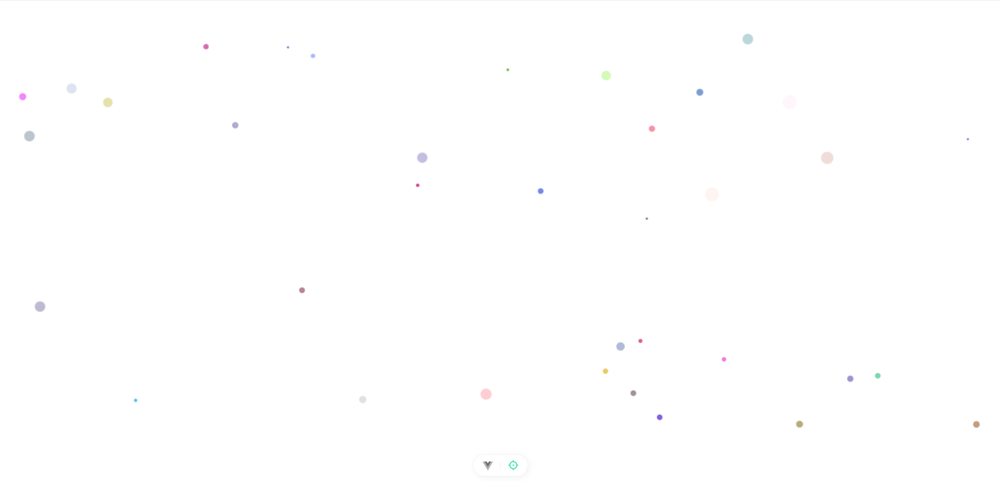

# ParticleSystem
A simple particle canvas using JS

# Demo


# Usage
Download the ParticleCanvas.vue file and add in your project   
open App.vue
```vue
<script setup lang="ts">
import ParticleCanvas from './components/ParticleCanvas.vue';
... // other codes
</script>

<template>
<ParticleCanvas />
... // other codes
</template>
```
